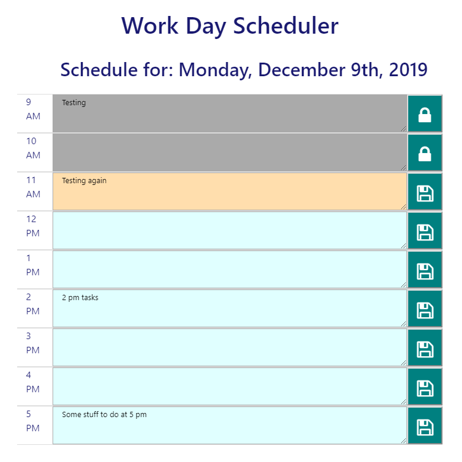

# DayPlanner

This app uses jQuery and localStorage to keep track of tasks/meetings and the hour when they should be done.  

## Layout 

The current date is displayed at the top of the page.   Hours are color-coded:

* Gray - the hour is already past and cannot be further modified.  The "save" icon is replaced with a lock and the task area cannot be modified. 
* Pale peach - the current hour 
* Light blue - hours that have not yet past and can still be modified.  

## Usage 

For hours that are not yet past, users can type text in the area to the right of a given hour, and then click on the file icon on that row to save the information.   If the page is reloaded, the data is recovered from local storage.

For responsiveness, when the screen is narrower than 576 pixels ("xs" in Bootstrap) the big "Work Day Scheduler" banner is hidden to save real estate.  On screens narrower than 768 pixels ("md" in Bootstrap) the icons for lock and save are made smaller.   

